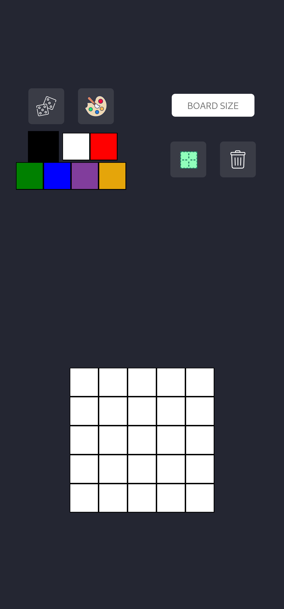

# Project Pixel Art

## Link

[pixel-art.vercel](https://paulo-pixel-art.vercel.app/)

## About

This is my 4th project during my journey at Trybe!

Pixel Art is a web application that consists of a pixel art editor, where users can express their creativity by creating pixelated images. This is my first project developed from HTML and CSS to the logical part with JavaScript, thus implementing a color palette that allows users to choose colors and paint freely on a white board!

## Repository Structure

- The `src` folder contains all the code

- The folder `src/assets` contains the images used in the project

## Implemented Features

## Implemented the Color Palettes Section to the Page

  

    The page contains a section for manipulating colors
  
  

- The default colors are: `black` | `white` | `red` | `green` | `blue`

- The color `black` is always selected by default when the page loads

- You can randomize the existing colors in the palette, excluding the colors `black` and `white`; they will always be the first and second colors, respectively

- You can add new colors through the color input with the `id` named `input-custom-color`, and it is not possible to add duplicate colors

## Implemented a Board to the Page

  

    The page contains a pixel board
  
  

- Initially, the pixel board has **5 columns** and **5 rows**

- The initial color of each pixel on the board is `white`

- Each pixel has a height and width of 40px, including its content and excluding the 1px wide black border

## Implemented Board Control Section to the Page

  

   The page contains a section to manipulate the board
  
  

- It is possible to change the board size using the input with the `id` named `board-size-input`, the minimum value is **5** (generating a 5x5 board) and the maximum value is **32** (generating a 32x32 board)

- It is possible to remove or add borders to the board pixels using the input with the `id` named `border-toggle`, the `gridTemplateColumns` and `gridTemplateRows` properties are altered to maintain the pixels with a width and height of 40px regardless of whether they have borders or not

- You can clear the board using the input with the `id` named `clear-board`, it not only completely clears the board but also resets its size to **5x5**

## Implemented localStorage for the page

  

    Important information is stored in localStorage
  
  

- The current color palette is saved in localStorage with the key `colorPalette`

- User-added and/or randomized colors are preserved when reloading the page

- Painted pixels are saved in localStorage with the key `pixelBoard`

- The board is filled with the same colors used previously, in the correct positions upon page reload

- The size of the board is saved in localStorage with the key `boardSize`

- The board maintains its size when reloading the page

---
